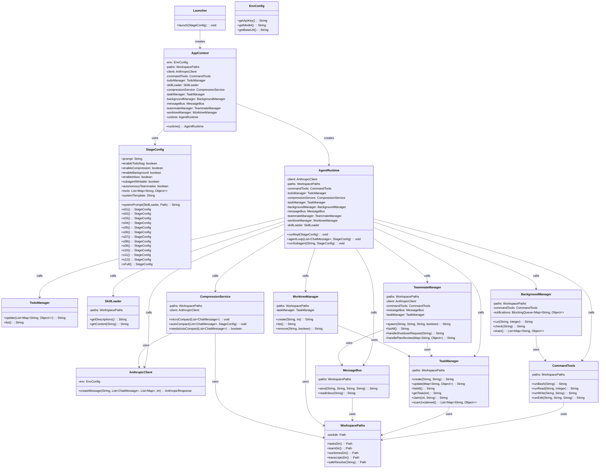
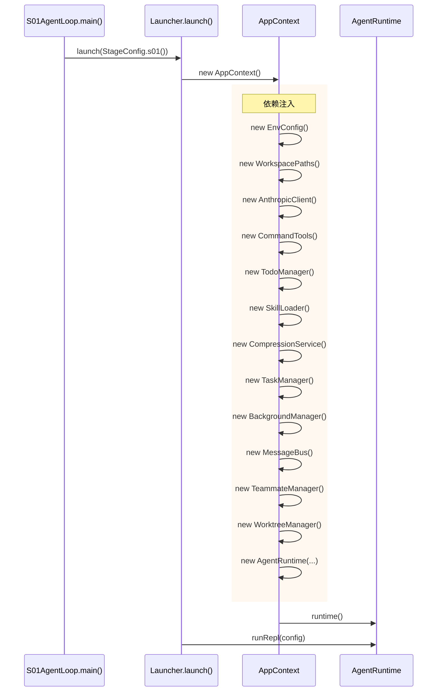
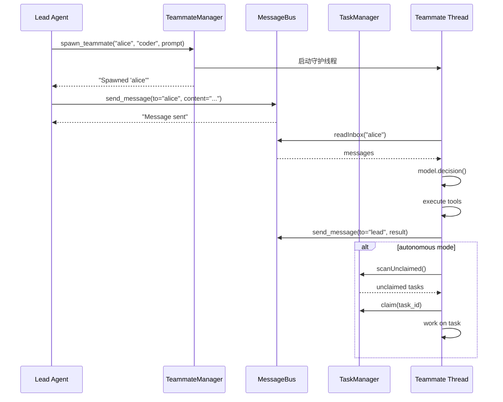
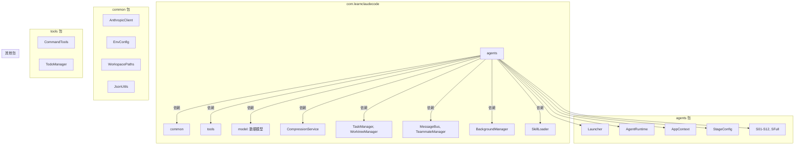

# 核心架构 UML 图

## 1. 类图 (Class Diagram)


```

## 2. 核心流程时序图 (Sequence Diagram)

### 2.1 Agent 主循环

```mermaid
sequenceDiagram
    participant User
    participant REPL as AgentRuntime.runRepl()
    participant Loop as agentLoop()
    participant Client as AnthropicClient
    participant Tools as CommandTools
    participant Config as StageConfig

    User->>REPL: 用户输入 query
    REPL->>Config: 获取 systemPrompt, tools
    REPL->>Loop: agentLoop(messages, config)

    rect rgb(240, 248, 255)
        Note over Loop: 前置处理
        alt enableCompression
            Loop->>Loop: microCompact() / autoCompact()
        end
        alt enableBackground
            Loop->>Loop: backgroundManager.drain()
        end
        alt enableInbox
            Loop->>Loop: messageBus.readInbox("lead")
        end
    end

    Loop->>Client: createMessage(system, messages, tools)
    Client-->>Loop: AnthropicResponse

    alt stop_reason == "tool_use"
        loop 工具调用
            Loop->>Tools: execute tool
            Tools-->>Loop: tool_result
            Loop->>Loop: messages.add(tool_result)
            Loop->>Client: 继续下一轮
            Client-->>Loop: response
        end
    else stop_reason != "tool_use"
        Note over Loop: 返回文本结果
    end

    Loop-->>REPL: 循环结束
    REPL-->>User: 打印结果
```

### 2.2 启动流程



### 2.3 多 Agent 协作流程 (S09-S11)



## 3. 包结构图 (Package Diagram)



## 4. 阶段能力演进图


## 5. 关键设计模式图

```mermaid
graph TD
    subgraph "依赖注入 (Dependency Injection)"
        DI1[AppContext 构造函数] --> DI2[创建所有服务]
        DI2 --> DI3[AgentRuntime 聚合]
    end

    subgraph "策略模式 (Strategy Pattern)"
        SP1[StageConfig] --> SP2[s01()-s12()]
        SP2 --> SP3[不同能力配置]
    end

    subgraph "责任链模式 (Chain of Responsibility)"
        CH1[agentLoop] --> CH2[compression]
        CH2 --> CH3[background drain]
        CH3 --> CH4[inbox read]
        CH4 --> CH5[model call]
    end

    subgraph "生产者-消费者 (Producer-Consumer)"
        PC1[BackgroundManager] --> PC2[execute thread]
        PC2 --> PC3[notifications.offer]
        PC3 --> PC4[drain()]
    end
```

## 6. 核心架构总结

| 设计模式 | 位置 | 说明 |
|---------|------|------|
| **依赖注入** | AppContext 构造函数 | 所有服务通过构造函数注入，AgentRuntime 聚合所有服务 |
| **策略模式** | StageConfig | s01-s12 不同阶段对应不同"策略"（工具集 + 能力开关） |
| **责任链** | AgentRuntime.agentLoop() | 每轮循环依次处理：压缩 → 后台结果 → inbox → 模型调用 |
| **生产者-消费者** | BackgroundManager | execute 线程生产通知，drain() 消费 |
| **单例运行时** | AppContext.runtime() | 全局共享一个 AgentRuntime 实例 |
| **文件型持久化** | TaskManager, MessageBus | JSON/JSONL 文件存储，无外部依赖 |